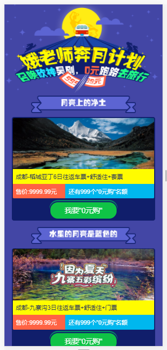
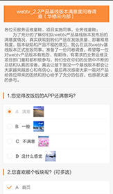

# H5-Activities
存放部分活动页面,包含投票,问卷,大转盘,砍价,刮刮卡,摇一摇,优惠券,意见收集活动......

一部分是自己写过的，一部分是以前参考过的活动（如原作者看到介意分享，可联系本人删除）

## 项目新运行

```
git clone https://github.com/FernAbby/activities.git

cd activities

npm i

npm start 

```

## 现存活动

* airlines --- 接机活动

* appBargain --- 砍价活动

 

* appdownload --- App下载引导页

* autumn --- 秋季活动

* beauty --- 颜值大比拼

* bonus --- 抢红包活动

* complain --- 年终报告

* coupon --- 优惠券活动

* flavor --- 年味儿活动

* homeinns --- 如家酒店

* integralMall --- 积分商城部分页面

* lottery --- 大转盘抽奖

 

* marathon --- 马拉松活动

* nationalDay --- 国庆节活动

* questionnaire --- 调查问卷



* represent --- 谁能代表大四川

* scratch --- 刮刮卡

 

* SDbargain --- 双旦砍价活动

* SDplay --- 双旦去玩

* shaking --- 摇一摇活动

 

* shishui --- 旅舍试睡活动

* turnplate --- 大转盘活动

* valentine --- 情人节活动

* xlxs --- 西岭雪山活动

* YN9 --- 云南9元活动

* yyy --- 测试活动


